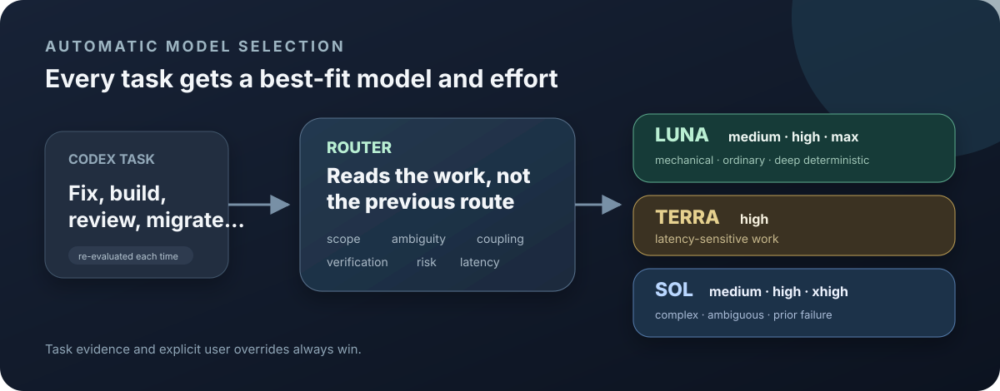
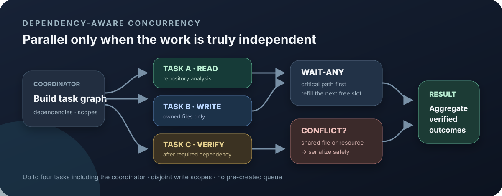

# Codex Auto Model Router — Dynamic Per-Segment Routing

[](https://github.com/openai/skills)
[](LICENSE)
[](https://github.com/orange-the-weak/codex-auto-model-router/actions/workflows/validate.yml)

**Automatic, dynamic per-segment model, reasoning, and concurrency routing for GPT-5.6 in OpenAI Codex.** Evidence-calibrated routing sends each bounded task to Sol, Terra, or Luna at the lowest sufficient effort—with no external API or API key.

[中文说明](README.zh-CN.md)

## Why this tool?





## Quick start

Send this in Codex:

```text
$skill-installer Install Codex Auto Model Router from https://github.com/orange-the-weak/codex-auto-model-router
```

Restart Codex afterward. To install all 30 optional custom-agent presets or migrate from the old name, clone the repository and run the installer for your platform:

```bash
git clone https://github.com/orange-the-weak/codex-auto-model-router.git
cd codex-auto-model-router
./install.sh
```

Windows PowerShell:

```powershell
.\install.ps1
```

## Evidence-backed routing

The policy is calibrated from OpenAI coding results and Codex credit rates, CursorBench 3.2, Artificial Analysis, and the DeepSWE, Terminal-Bench, and SWE-Bench Pro methodologies. ChatBench is retained only as a weak speed/cost proxy because its category scores reweight third-party API metrics rather than run an independent coding-agent harness.

| Route | Default use |
|---|---|
| **Luna medium** | All mechanical and repetitive work; automatic routing never goes lower |
| **Luna high** | Default for ordinary bounded work |
| **Luna max** | Genuinely deep or large deterministic work whose latency budget allows it |
| **Terra high** | Explicit latency priority when a shorter reasoning path matters more than Luna/high quality |
| **Sol medium** | Bounded complex work |
| **Sol high** | High ambiguity, coupling, judgment, or consequence |
| **Sol xhigh** | A failed complex attempt, or explicit user choice |

Luna currently uses 4% of Sol's Codex token credits. CursorBench places Luna/medium above Luna/low by 10.1 points, so saving an already-low Luna credit rate no longer justifies the quality loss. Terra/high scores above Sol/low while its ChatBench response proxy is substantially shorter; it therefore survives as a latency specialist rather than a default middle tier. Task evidence and user overrides always win, and the full model-effort matrix remains explicitly selectable. The snapshot is versioned, offline, and valid for 90 days; invalid or stale evidence falls back without blocking work. See the [full evidence report](references/benchmark-evidence.md) and [machine-readable snapshot](references/benchmark-evidence.json).

Native Ultra is off by default. The Router never selects it automatically because it already has dependency-aware concurrency. If you explicitly enable Ultra, the request is kept to one bounded Sol or Terra Segment and Router-managed parallelism is disabled, so the two orchestration layers do not stack.

For an illustrative mixed workload, the seven-lane policy estimates **10–20% faster AI-work turnaround** than using Sol/medium everywhere, while the Cursor cost proxy falls by about 62%. Higher Luna output volume is not counted as a speed gain, and API cost is not Codex subscription cost. These remain hypotheses to refine from local history.

## How it works

- Re-evaluates every applicable request instead of inheriting the previous route.
- Uses a one-Segment fast path. `begin` persists the canonical plan and identity; after that, `finish` and `restore` resolve by three IDs instead of rebuilding the plan after context compaction.
- Splits analysis, implementation, verification, or review only when different routes materially help.
- Caps automatic concurrency at 4 parallel tasks, then reduces it to useful independent width and observed free slots. The coordinator reserves one slot, so a four-slot Codex session normally peaks at three parallel tasks.
- Counts the coordinator in the visible summary: `Concurrency plan: 4 tasks (including main)`. Internal capacity still remains one coordinator plus three leaf tasks.
- Without observed capacity, dispatches one task and refills only after another slot is confirmed. Requests above 4 require proven free capacity; no pre-created queue.
- Uses critical-path-priority wait-any scheduling to reduce tail latency. Compatible short siblings may merge; long tasks split only at real independent boundaries.
- Keeps the full conversation in the coordinator; parallel tasks receive only a bounded context capsule with necessary decisions, scope, acceptance, and immutable IDs.
- Names each leaf agent from its task content, such as `runtime_ledger_audit`, instead of Router-generated random or ordinal labels. Any extra decorative nickname comes from the Codex client.
- Requires disjoint write scopes and serializes Git index, lockfiles, project files, migrations, deploy targets, shared simulators, and other mutable resources through conflict keys.
- Uses a standard 4-segment/4-switch budget, adaptive 6/6 for genuinely complex or large plans, and an explicit hard limit of 8/8. Restore counts as a switch.
- Keeps fallback inside GPT-5.6: Sol tries Terra then Luna; Terra tries Sol then Luna; Luna tries Terra then Sol. GPT-5.5 is allowed only when the complete 5.6 family is unavailable.
- Announces the selected model and reasoning once per segment, stops on failure, and restores a verified original GPT-5.6 route once.
- Keeps model-switch messages readable: task and route information appear first, while bounded internal IDs and state stay at the end of the continuation prompt.
- Records only verified execution in a local JSONL ledger; recommendations never count as observed use.
- Captures each parallel task's dispatch-confirmed and result-received boundaries on one coordinator monotonic clock, then derives actual elapsed time, cumulative parallel-task time, peak concurrency, and slot utilization. Models never supply timing numbers.
- Keeps older aggregate-only records readable but excludes them from verified history.
- Tracks verified routing, queue, startup, switch/Restore, useful-execution, round-trip, and state-gate overhead without guessing missing data.
- Ends each Apply brief with the runtime-generated current-run concurrency line, reproduced verbatim; Query/history is labeled as a historical aggregate. Reliable schema-v2 timing comes only from complete per-task intervals; otherwise the brief says `测量：待记录`. `并行省时估算` compares observed overlap with concatenating the same tasks; it is not a controlled A/B speedup result.

## Use

```text
$codex-auto-model-router Analyze this repository and recommend routes.
$codex-auto-model-router Implement this feature with dynamic segment routing.
$codex-auto-model-router Use GPT-5.6 Terra high for this task.
$codex-auto-model-router Use GPT-5.6 Luna high for this bounded implementation.
$codex-auto-model-router Use GPT-5.6 Luna max for this bounded refactor.
$codex-auto-model-router Explicitly enable Sol ultra for this one bounded task.
$codex-auto-model-router Query usage ratios and retune from observed outcomes.
```

Example notice:

```text
Codex automatic routing | Task segment: Analyze the change | Model: GPT-5.6 Sol | Reasoning: high | High ambiguity
Codex automatic routing | Concurrency plan: 4 tasks (including main) | Source: smart-reduced | Critical-path priority
并发：峰值 4（含主任务）｜实际用时：2分0秒｜并行任务累计用时：4分48秒｜并行省时估算：58%｜槽位利用：85%
```

Reports are written to `docs/codex-model-routing-report.md`; verified usage is stored in `.codex/model-routing-history.jsonl`. The ledger contains routing metadata and outcomes, not prompts, source code, secrets, or conversation text.

## A personal note

This is my first open-source project. I built it after repeatedly stopping between Sol, Terra, and Luna and wondering whether a task really needed the heavier option.

Eventually I turned that recurring decision into a Skill. Practical feedback—especially a route that was too strong, too weak, or needlessly split—is more useful than a star.

本开源项目已链接并感谢 [LINUX DO 社区](https://linux.do/) 的支持与交流。

## Feedback

Found a route that was too weak, too expensive, or unnecessarily fragmented? [Share a routing result](https://github.com/orange-the-weak/codex-auto-model-router/issues/new?template=routing-feedback.yml) without private prompts or source code. For bugs and proposals, use [GitHub Issues](https://github.com/orange-the-weak/codex-auto-model-router/issues).

## Compatibility and development

This project requires Codex with personal Skill support. Same-task overrides and custom agents depend on the active surface. While any GPT-5.6 route is selectable, the Skill neither falls back nor restores to GPT-5.5 or an ambiguous `available-default`. If a task starts on 5.5 and successfully enters 5.6, it stays on the verified 5.6 route. A 5.5 fallback is recorded and shown only when Sol, Terra, and Luna are all unavailable.

```bash
python3 -m unittest discover -s tests -v
python3 tests/validate_distribution.py
```

See [CONTRIBUTING.md](CONTRIBUTING.md), [SECURITY.md](SECURITY.md), and [LICENSE](LICENSE). This independent community project is not affiliated with or endorsed by OpenAI.
