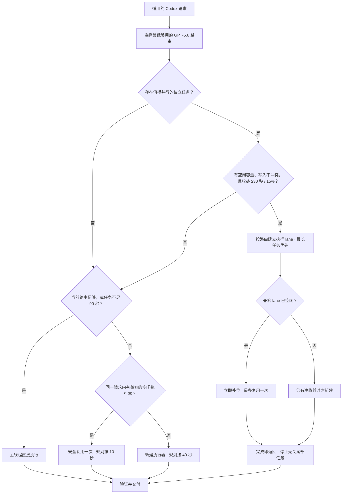

# Codex Auto Model Router

[](https://github.com/orange-the-weak/codex-auto-model-router/actions/workflows/validate.yml)

**面向 OpenAI Codex 的轻量 GPT-5.6 模型与推理强度路由器。** 自动选择 Sol、Terra 或 Luna，以及 low 到 max 推理；只有确实能提速时才启用有界并发。不需要外部 API 或 API Key。

[English](README.md) · [路由反馈](https://github.com/orange-the-weak/codex-auto-model-router/issues/new?template=routing-feedback.yml) · [问题反馈](https://github.com/orange-the-weak/codex-auto-model-router/issues/new?template=bug-report.yml)

## 为什么做这个工具？

GPT-5.6 给 Codex 带来了很多有用的模型和推理组合，但每次都判断一遍，很快也成了一件麻烦事。我最初只是想让选择自动化，后来又发现：如果 Router 自己挡住了真正的工作，那还不如不用。

所以 v2 默认采用 fail-open 的 Lite 架构：快速选择，需要时只委派一次，台账不再进入关键路径。这也是我的第一个开源项目，欢迎把真实使用中的好坏都告诉我。

## 快速安装

直接告诉 Codex：

> 从 `https://github.com/orange-the-weak/codex-auto-model-router` 安装 `codex-auto-model-router` Skill。

或手动安装：

```bash
git clone https://github.com/orange-the-weak/codex-auto-model-router.git
cd codex-auto-model-router
./install.sh
```

安装后重启 Codex。

## Router Lite

每个适用请求只走三条路径之一：

| 路径 | 行为 |
|---|---|
| Fast | 当前模型已经合适，或任务本身比启动执行器更快，主线程直接执行。 |
| Delegate | 启动或安全复用一个显式选模的内部执行器，主线程不切模型。 |
| Parallel | 只并行真正独立、耗时且当前有槽位的任务。 |

默认路径不再使用 Restore、计划哈希、游标、环境变量门禁或阻塞式台账。路由或执行器启动失败时，普通任务由主线程接管一次。旧的严格状态机只在用户明确要求严格审计或防重放时启用。

微小机械修改、构建/安装这类确定性的工具等待链路，以及预计不足 90 秒的有界任务，在当前已验证 GPT-5.6 路由足够时留在主线程。较弱的当前路由不会覆盖推荐结果；用户显式指定始终优先。

委派任务只携带自足的最小上下文，达到验收条件就停止。同一请求内，只有仓库、路由、权限和写入所有权都仍然匹配时，空闲执行器才允许复用一次；不会跨用户请求复用。

自动并发要求任务真正独立、写入范围不重叠、容量可验证，并且扣除激活和汇总成本后仍有收益。最新本机探针把原来的 40 秒拆开了：新执行器首次调用工具需要 35.5–39.6 秒，复用同一执行器只需 2.7–9.4 秒。规划因此保守采用新建 40 秒、复用 10 秒，并要求至少节省 30 秒和 15%；兼容执行器完成后立即补位。这些只是本机规划先验，不是平台 SLA 或提速承诺。



## v0.2 更新重点

- Router Lite 从普通任务中移除了 Restore、哈希、状态门和阻塞式台账。
- 当前 GPT-5.6 路由足够时，短任务和确定性工具链由主线程直接完成。
- 并发规划分别计算新建与复用成本，按路由建立执行 lane，并在兼容执行器完成后立即补位。
- 复用只发生在同一请求内且最多一次；换模型、写入所有权未释放、失败任务和敏感外部操作不会复用。
- Ultra 仍需用户显式开启；只要 Sol、Terra 或 Luna 任一可用，就不回退 GPT-5.5。

## 模型梯度

| 任务 | 默认路由 |
|---|---|
| 确定性机械任务 | Luna / medium |
| 普通有界任务 | Luna / high |
| 大型有界扫描或审查 | Luna / xhigh |
| 大型确定性深度任务 | Luna / max |
| 明确追求低延迟 | Terra / high |
| 有界复杂任务 | Sol / medium |
| 高歧义、高耦合或高后果 | Sol / high |
| 复杂推理或验证已有失败 | Sol / xhigh |

Ultra 永不自动启用。用户显式使用 Ultra 时，由其原生编排接管，并关闭 Router 并发。只有整个 GPT-5.6 家族都确认不可用时才回退 GPT-5.5。

## 测评与台账

路由策略离线参考 OpenAI、Artificial Analysis、CursorBench、ChatBench、DeepSWE、SWE-Bench Pro 与 Terminal-Bench 的公开编码测评。任务本身的证据和用户指定始终优先；API effort 数据只作为相对能力、延迟和输出量先验，不代表 Codex 订阅成本或真实耗时。

完整数据见[测评证据](references/benchmark-evidence.md)和[机器可读快照](references/benchmark-evidence.json)。快照缺失、损坏或过期时，Router 直接使用确定性规则，不阻塞任务。

使用台账在项目结果完成后尽力写入，用于统计实际模型和并发比例；记录失败不会影响项目交付。

## 开发

```bash
python3 -m unittest discover -s tests
python3 tests/validate_distribution.py
```

隐私安全的反馈与贡献方式见 [CONTRIBUTING.md](CONTRIBUTING.md)。
